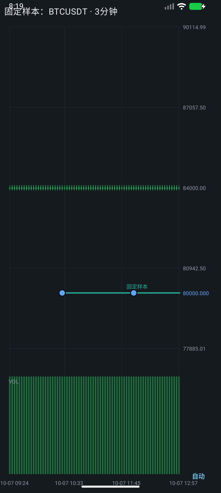
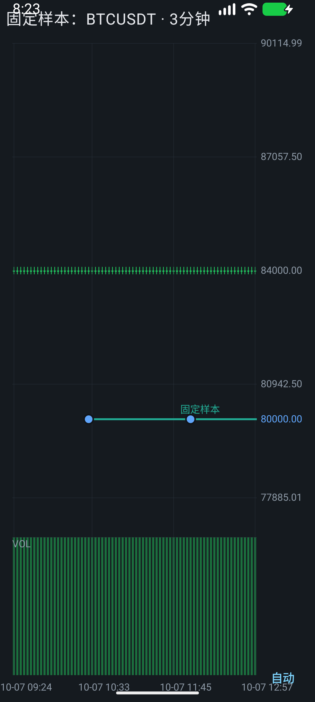
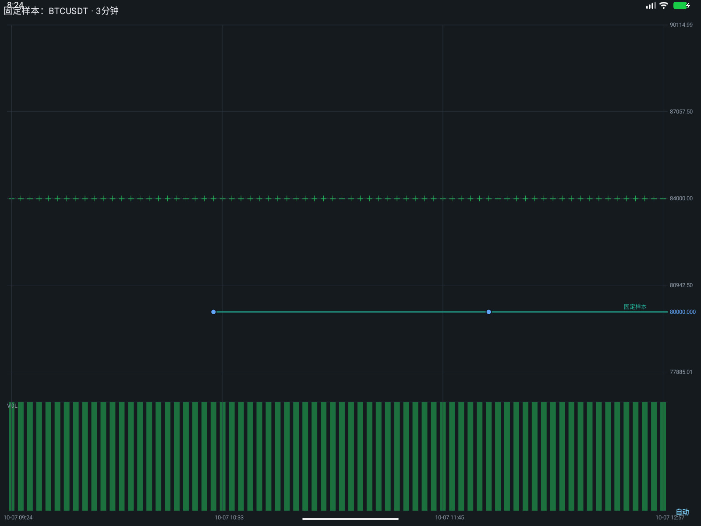

# 手机价格轴缩放修复

日期：2026 年 10 月 7 日。项目：Guaili Android。

## 根因及修复

原价格轴缩放系数被限制在 0.25～4，显示价格跨度最多扩大四倍；窄幅 3 分钟 K 线在 84000 附近时，仍可能无法看到 80000 警报线。主图单指拖动只处理时间，不能平移价格。`LaunchedEffect(rows.size)` 又会在新增 K 线时重置缩放及回看位置。

另外，Canvas 绘制会把选中警报纳入价格范围，而触摸命中、光标和快速创建入口使用另一套范围计算。这会造成线段显示位置与实际触摸坐标不一致。

现在使用统一的 `PriceBounds`：可见 K 线、通道与选中警报的自动范围统一计算，Canvas、警报命中、光标和快捷创建使用相同范围。待保存的警报几何也参与自动范围，拖动警报仍冻结按下时的变换。

- 右侧价格轴下拖压缩、上拖展开。每 100 dp 对应跨度乘／除 e，灵敏度与屏幕密度无关；从按下时的范围计算，避免事件数量和绘制频率影响缩放结果。移除原四倍范围上限，以浮点有效精度及有限值约束边界。
- 主图上下拖动平移价格；左右拖动继续平移时间。分别采用系统触摸阈值，纯纵向操作不会因轻微横向抖动进入回看。成交量区不进行价格平移。
- 双击价格轴或点轴底“自动”恢复自动价格范围。自动入口为 68×48 dp，提供当前自动／手动状态的无障碍描述；光标模式中仍可缩放价格轴。
- 新 K 线和同桶更新保留手动价格范围、时间跨度；历史回看按旧最新时间修正偏移。品种／周期切换创建独立视口。

价格范围计算直接累计极值，并按输入缓存结果；移除原每次绘制构造装箱价格列表的路径。未新增网络请求或计时器，价格导航不修改警报的价格／时间端点。本次不声明 CPU、输入延迟或真机性能提升。

## 验证

- `:app:testDebugUnitTest`：257 项通过，0 失败／错误。新增五项价格范围回归，覆盖 84000→80000、缩放锚点与逆变换、选中警报的坐标及命中一致性、小数值／平价精度、历史前插与新 K 线追加。
- `:app:lintDebug`：0 错误，44 条项目现有警告；新价格视口、图表手势及触摸测试文件没有新增 Lint 问题。Debug、AndroidTest 和 Release 构建通过。
- 原生触摸：手机 1080×2400、密度 420 dpi、字号 1.0 下，新增 `KlinePriceNavigationTest` 三项与原 `PriceAlertInteractionTest` 四项全部通过。另在真实资源字号 1.3 下执行三项新测试，并在同一专用模拟器切换为 1600×1200、密度 160 dpi 的平板宽屏后再执行三项，均通过。合计 13 次测试执行。
- 固定样本为 100 根 3 分钟 K 线，价格在 83900～84100，警报线为 80000。实际验证价格轴压缩后的点击命中、图内价格平移、新 K 线刷新保留范围、自动按钮／双击复位、光标模式下轴缩放及选中线段按显示坐标移动。导航操作不调用警报修改／创建回调。
- 原有四项端到端测试使用设备内 MockWebServer，验证绘图、移动、撤销、暂停、重新编辑、取消与捏合、趋势端点及旧版兼容，没有向真实警报服务写入。

测试使用新建的专用模拟器；没有覆盖安装或改变原有 `emulator-5554`。截图为原生 UI 输出及固定样本，不能当作实时行情。未完成真机触摸、不同刷新率或性能测量。

## 原生截图

完整 K 线页的现有流程截图：[full-app-phone.png](assets/price-axis-fix/full-app-phone.png)。

## 安装包

`dist/price-axis-fix/GuailiAndroid-price-axis-fix.apk` 为 Release 构建，沿用项目开发调试证书签名，包名 `com.gouge.guaili`、版本 `0.3.0`。签名与原 `dist/v0.3.0/GuailiAndroid-v0.3.0.apk` 相同，可覆盖安装同签名版本并保留数据；尚非生产证书签名。`apksigner verify` 的 v2／v3 验证通过，SHA-256 见同目录 `SHA256.json`。

该最终签名 APK 已在专用模拟器覆盖安装并启动 `MainActivity`，启动成功，包标志不含 `DEBUGGABLE`，崩溃日志为空。触摸测试使用 Debug 构建的原生图表；没有将其描述为 Release 输入延迟或真机性能测量。
